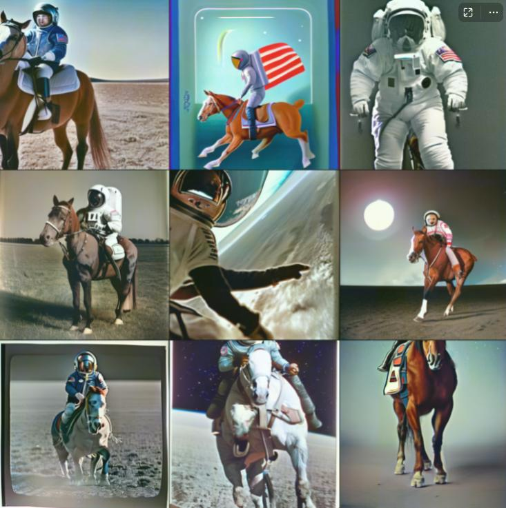
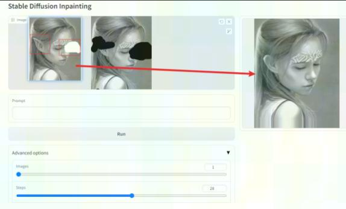

# Stable_Diffusion_MLU
## 前言
- 支持 MLU370X8 单卡推理
- 支持 text2img、img2img、image inpainting 功能

## 版本信息
- Cambricon Driver：5.10.13
- Cambricon Docker: yellow.hub.cambricon.com/pytorch/pytorch:v1.15.0-torch1.9-ubuntu18.04-py37
- StableDiffusion 官方代码：https://github.com/Stability-AI/stablediffusion.git
- Commit ID: cf1d67a6fd5ea1aa600c4df58e5b47da45f6bdbf
- 框架: PyTorch

## 准备模型
- Text2img、Img2img (./models/v2-1_768-nonema-pruned.ckpt)  
- Image Inpainting (./models/512-inpainting-ema.ckpt)
```
wget -P ./models https://huggingface.co/stabilityai/stable-diffusion-2-1/resolve/main/v2-1_768-nonema-pruned.ckpt
wget -P ./models https://huggingface.co/stabilityai/stable-diffusion-2-inpainting/resolve/main/512-inpainting-ema.ckpt
```

## 安装依赖
```
pip3 install -r requirements.txt
```

## 推理

- Text2Img
```
# txt2img测试
python3 scripts/txt2img.py --prompt "a professional photograph of an astronaut riding a horse" --ckpt ./models/v2-1_768-nonema-pruned.ckpt --config configs/stable-diffusion/v2-inference-v.yaml --device mlu
```


- Img2Img
```
python3 scripts/img2img.py --prompt "A fantasy landscape, trending on artstation" --init-img ./outputs/txt2img-samples/samples/00003.png --strength 0.8 --ckpt ./models/v2-1_768-nonema-pruned.ckpt --config configs/stable-diffusion/v2-inference-v.yaml
```


- Image Inpainting
```
# Image Inpainting with Stable Diffusion 测试 with gradio
# gradio 页面的 Adavanced Options 中的 Images 建议设为 1
python3 scripts/gradio/inpainting.py configs/stable-diffusion/v2-inpainting-inference.yaml ./models/512-inpainting-ema.ckpt
```
